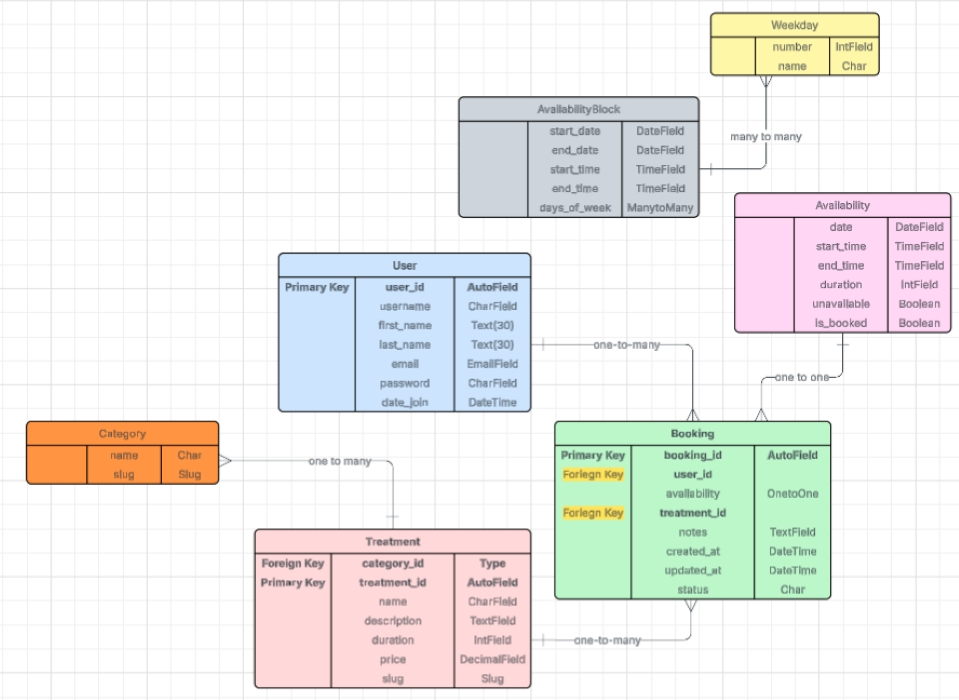

# CT Beauty: Salon Appointments Made Simple

## Project Description

**CT Beauty** is a clean, responsive salon booking app — a **Django MVP** focused on the core experience: discover services, pick a treatment, and book a time slot with minimal friction. The UI is mobile-first (Bootstrap 5) with a calm, brand-led palette and accessible forms.

### What it does
- **Browse services** by category with clear descriptions, durations, and prices.
- **Book a slot**: choose a treatment, then select an available time.
- **Manage bookings (CRUD)**:
  - **Create** a booking
  - **Read** your upcoming bookings
  - **Update** (reschedule) by changing availability
  - **Delete** by cancelling the booking
- **Secure auth**: sign up / sign in with **django-allauth** (username or email), strong password rules, and brute-force protection via **django-axes**.

### How it works (at a glance)
1. **Services & Treatments** are defined in the database (admin supports full CRUD).
2. **Availability slots** represent bookable times; a **Booking** occupies one slot.
3. **Users** authenticate via allauth; protected views handle booking **CRUD** (reschedule = update).
4. The interface stays consistent across desktop, tablet, and mobile.

> Goal: deliver a smooth, trustworthy booking experience with clear information, minimal friction, and consistent styling across pages.

## Tech Stack

| Layer                | Libraries / Tools                                  | Notes |
|---------------------|-----------------------------------------------------|------|
| **Backend**         | Django 4                                           | Core framework (MVP) |
| **Authentication**  | django-allauth                                     | Username or email login, templates |
| **Forms (server)**  | django-crispy-forms, crispy-bootstrap5             | Clean Bootstrap 5 form rendering |
| **Frontend (client)** | Bootstrap 5, custom CSS, minimal JS               | Responsive UI, brand color `#CF9274` |
| **Database**        | PostgreSQL, `dj-database-url`                      | DB config via environment variables |
| **Static files**    | WhiteNoise                                         | Compressed static serving in prod |
| **Security**        | django-axes                                        | Brute-force protection |
| **Env/Config**      | python-dotenv                                      | Load `.env` in development |
| **Quality/Tooling** | djLint, Conventional Commits                       | Template formatting & commit convention |

## Entity Relationship Diagram (ERD)

## Credits

### Django & Core Docs
- [Django Documentation](https://docs.djangoproject.com/en/4.2/) — general reference
- [Forms](https://docs.djangoproject.com/en/4.2/topics/forms/) — ModelForm, widgets
- [Messages Framework](https://docs.djangoproject.com/en/4.2/ref/contrib/messages/) — flash alerts
- [Sites Framework](https://docs.djangoproject.com/en/4.2/ref/contrib/sites/) — domain/protocol for email links
- [Settings Reference](https://docs.djangoproject.com/en/4.2/ref/settings/)
  - [Middleware](https://docs.djangoproject.com/en/4.2/topics/http/middleware/)
  - [Templates (DIRS, APP_DIRS, context processors)](https://docs.djangoproject.com/en/4.2/ref/templates/api/)
  - [Authentication backends](https://docs.djangoproject.com/en/4.2/topics/auth/customizing/#specifying-authentication-backends)
  - [Password validation](https://docs.djangoproject.com/en/4.2/topics/auth/passwords/#password-validation)
  - [Password hashing](https://docs.djangoproject.com/en/4.2/topics/auth/passwords/#password-hashing)
  - [Time zones](https://docs.djangoproject.com/en/4.2/topics/i18n/timezones/)
- Static files & production
  - [Static files (`STATIC_URL`, `STATICFILES_DIRS`, `STATIC_ROOT`)](https://docs.djangoproject.com/en/4.2/howto/static-files/)
  - [collectstatic](https://docs.djangoproject.com/en/4.2/ref/contrib/staticfiles/#collectstatic)
  - [WhiteNoise](https://whitenoise.readthedocs.io/en/stable/) (compressed storage & middleware)

### Authentication (django-allauth)
- [Allauth Docs](https://docs.allauth.org/) — configuration & templates
- [Account settings](https://docs.allauth.org/en/latest/account/configuration.html)
  — `ACCOUNT_LOGIN_METHODS`, `ACCOUNT_SIGNUP_FIELDS`, `ACCOUNT_DEFAULT_HTTP_PROTOCOL`

### Forms Styling
- [django-crispy-forms](https://django-crispy-forms.readthedocs.io/) — `{{ form|crispy }}`, helpers/layouts
- [crispy-bootstrap5](https://github.com/django-crispy-forms/crispy-bootstrap5) — Bootstrap 5 integration

### Email & Utilities (`utils.py`)
- [Django email overview](https://docs.djangoproject.com/en/4.2/topics/email/)
  and [EmailMultiAlternatives](https://docs.djangoproject.com/en/4.2/topics/email/#emailmessage-objects)
- [Rendering templates: `render_to_string`](https://docs.djangoproject.com/en/4.2/topics/templates/#django.template.loader.render_to_string)
- [Absolute URLs in emails: `build_absolute_uri`](https://docs.djangoproject.com/en/4.2/ref/request-response/#django.http.HttpRequest.build_absolute_uri)
- iCalendar attachment: [RFC 5545 (iCalendar)](https://www.rfc-editor.org/rfc/rfc5545)

### Signals & App Wiring (`signals.py`)
- [Django signals](https://docs.djangoproject.com/en/4.2/topics/signals/) — `pre_save`, `post_save`, `post_delete`, `@receiver`
- [Run after DB commit: `transaction.on_commit`](https://docs.djangoproject.com/en/4.2/topics/db/transactions/#performing-actions-after-commit)
- [AppConfig.ready()](https://docs.djangoproject.com/en/4.2/ref/applications/#django.apps.AppConfig.ready)

### Email (SMTP)
- [Gmail SMTP settings](https://support.google.com/mail/answer/7126229)
- [Google App Passwords](https://support.google.com/accounts/answer/185833)

### Security / HTTPS
- [Deployment checklist (SSL, secure cookies)](https://docs.djangoproject.com/en/4.2/howto/deployment/checklist/)
- [`SECURE_PROXY_SSL_HEADER`](https://docs.djangoproject.com/en/4.2/ref/settings/#secure-proxy-ssl-header)

### Database & Environment
- [dj-database-url](https://github.com/jacobian/dj-database-url) — DB config from env
- [python-dotenv](https://saurabh-kumar.com/python-dotenv/) — load `.env` in dev

### Frontend
- [Bootstrap 5](https://getbootstrap.com/docs/5.3/) — cards, tables, buttons, utilities

### Tools & Linters
- [djLint](https://www.djlint.com/) — Django template formatter/linter

### Optional (used in this project)
- [django-axes](https://django-axes.readthedocs.io/) — brute-force protection
- [django-summernote](https://github.com/summernote/django-summernote) — rich text editor
