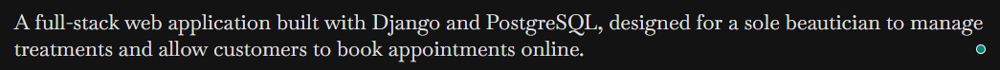
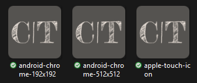
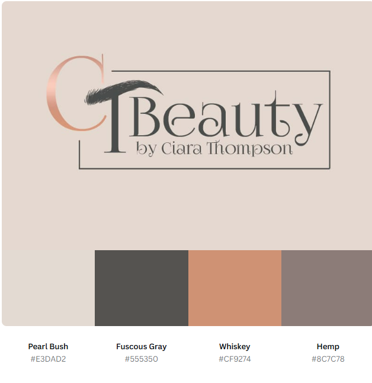
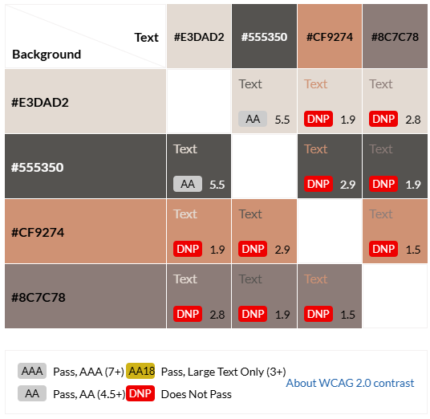
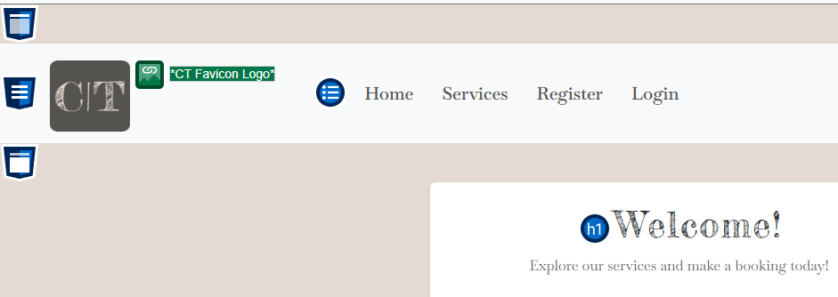
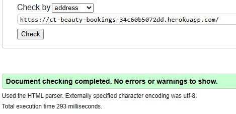
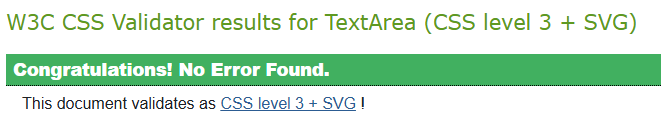

# **CT Beauty: Salon Appointments Made Simple**
| [➡️**View CT Beauty NOW!!**](https://ct-beauty-bookings-34c60b5072dd.herokuapp.com/)
| [➡️**Github Repo**](https://github.com/KellyT4425/ctbeauty-bookings) | ⭐

## **Project Description**

**CT Beauty** is a clean, responsive salon booking app — a **Django MVP** focused on the core experience: discover services, pick a treatment, and book a time slot with minimal friction. The UI is mobile-first (Bootstrap 5) with a calm, brand-led palette and accessible forms.

### What it does
- **Browse services** by category with clear descriptions, durations, and prices.
- **Book a slot**: choose a treatment, then select an available time.
- **Manage bookings (CRUD)**:
  - **Create** a booking
  - **Read** your upcoming bookings
  - **Update** (reschedule) by changing availability
  - **Delete** by cancelling the booking
- **Secure auth**: sign up / sign in with **django-allauth** (username or email), strong password rules, and brute-force protection via **django-axes**.

### How it works (at a glance)
1. **Services & Treatments** are defined in the database (admin supports full CRUD).
2. **Availability slots** represent bookable times; a **Booking** occupies one slot.
3. **Users** authenticate via allauth; protected views handle booking **CRUD** (reschedule = update).
4. The interface stays consistent across desktop, tablet, and mobile.

> Goal: deliver a smooth, trustworthy booking experience with clear information, minimal friction, and consistent styling across pages.

## **Tech Stack** 💻

| Layer                | Libraries / Tools                                  | Notes |
|---------------------|-----------------------------------------------------|------|
| **Backend**         | Django 4                                           | Core framework (MVP) |
| **Authentication**  | django-allauth 🔒                                    | Username or email login, templates |
| **Forms (server)**  | django-crispy-forms, crispy-bootstrap5             | Clean Bootstrap 5 form rendering |
| **Frontend (client)** | Bootstrap 5, custom CSS, minimal JS               | Responsive UI, brand color `#555350` |
| **Database**        | PostgreSQL, `dj-database-url`                      | DB config via environment variables |
| **Static files**    | WhiteNoise                                         | Compressed static serving in prod |
| **Security**        | django-axes                                        | Brute-force protection |
| **Env/Config**      | python-dotenv                                      | Load `.env` in development |
| **Quality/Tooling** | djLint, Conventional Commits                       | Template formatting & commit convention |

## **User Stories** 🙋
- **Milestone: Functional Booking System**.

  **1.** As a logged-in user, I want to select a treatment, date, and time, So that I can schedule an appointment.

  **2.** As a potential customer, I want to browse the available treatments, So that I can decide which service to book.

  **3.** As a user, I want to see available dates and times, So that I can choose a suitable appointment slot.

  **4.** As a logged-in user, I want to view a list of my upcoming appointments, So that I can keep track of them.

  **5.** As a customer, I want to receive a booking success message, so that I know my booking is successful.

  **6.** As a user, I want to cancel or change my booking, So that I can manage my schedule as needed.

- **Milestone: Implementing User Registration and Login**.

  **1.** As a new customer, I want to register an account, So that I can log in and make a booking for a treatment.

  **2.** As a logged-in user, I want to log out of my account so that I can ensure my data is secure.

  **3.** As a user who forgot my password, I want to reset it using my email, So that I can regain access to my account.

  **4.** As a registered user, I want to log in to my account, so that I can access my personal dashboard and make or manage bookings.

- **Milestone: Admin Privileges & Control Panel**.

  **1.** As an admin, I want to view all upcoming bookings, So that I can prepare for upcoming appointments.

  **2.** As an admin, I want to change or cancel bookings, So that I can manage conflicts or emergencies.

  **3.** As an admin, I want to set my available working hours, So that customers can only book during those times.

## **Entity Relationship Diagram (ERD)** 🔁

## **Entities** ↔️

#### Category
- Groups services (e.g., Brows, Lashes, Waxing).
- Fields: `name`, `slug`.

#### Treatment
- A bookable service that belongs to a category.
- Fields: name, description, duration (mins), price, slug.
- FK: `category` → Category.

#### Availability
- A single bookable slot on a specfic date & time.
- Fields: `date`, `start_time`, `end_time`, `duration`, `unavailable`, `is_booked`.

#### AvailabilityBlock

- Defines recurring opening hours across a date range.
- Fields: `start_date`, `end_date`, `start_time`, `end_time`.
- M2M: `days_of_week` → Weekday.
- <em>Used by code to generate many Availability rows (no direct FK to slots)</em>.

#### Weekday

- Lookup for days of the week.
- Fields: `number (0–6)`, `name`.

> Note: AvailabilityBlock + Weekday are used to create the Availability schedule. This is a conceptual “generates” link handled in code, not a database FK.

#### Booking

- A user’s appointment for a specific slot & treatment.
- Fields: `notes`, `status`, `created_at`, `updated_at`.
- One-to-one: availability → Availability (each slot can be booked once).
- FKs: `user` → User, treatment → Treatment.

#### User

- Django auth user (email/username) who makes bookings.

### Integrity Rules

- **No double-booking**: Booking ↔ Availability is one-to-one; chosen slot is set is_booked=True.

- **Future & duration-matched**: only future slots that match the treatment’s duration are offered.

- **Delete behaviour**:
  * Booking.user → CASCADE (deleting a user removes their bookings).
  * Booking.treatment, Booking.availability → PROTECT (avoid orphaned bookings).

### Typical Flow

**1.** Admin creates AvailabilityBlocks (e.g., Mon–Fri 09:00–17:00 for a month) → app generates Availability slots.

**2.** User selects a Treatment; form lists only future, duration-compatible slots.

**3.** On submit, a Booking is created and the chosen Availability is marked booked.

**4.** When rescheduling, only the availability (time) is changed; the previous slot is freed.

## **Design** ✏️
[Google Fonts](https://fonts.google.com/specimen/Permanent+Marker) 
 
 
> Fredericka the Great  
> Baskervville  

This font pairing was chosen to:

- Differentiate hierarchy (decorative headers vs. clean body text).

- Reflect brand identity (luxury, creativity, and professionalism).

- Maintain accessibility, since serif fonts with high stroke contrast like Baskervville remain readable at body text sizes, while Fredericka the Great is used sparingly for emphasis.

[Favicons](https://favicon.io/) were created using the project’s CT Beauty branding to maintain a consistent identity across devices and platforms. 
  
**Purpose:**

- Provides a recognizable brand symbol in browser tabs, bookmarks, and on mobile devices.

- Ensures the application looks professional and polished across platforms.

- Enhances user trust and usability, making the site easy to identify.

[Colour Palette Generator](https://www.canva.com/colors/color-palette-generator/)
> The brand palette for CT Beauty consists of four main colours:

- Pearl Bush (#E3DAD2) – soft neutral background shade

- Fuscous Gray (#555350) – deep gray, ideal for text and accents

- Whiskey (#CF9274) – warm peach tone for highlights and accents

- Hemp (#8C7C78) – muted mauve-brown for secondary elements

These colours were chosen to reflect a modern, professional, and calming aesthetic while maintaining good readability and accessibility.  

## **Accessibility**

[EightShapes](https://contrast-grid.eightshapes.com/)
> The EightShapes contrast grid was used as it helps to ensure our chosen colour palette provides enough contrast between text and background colours for users with visual impairments. The grid was provided all colours that the Colour Palette Generated provided based off of the sites main image.  

The [WAVE](https://wave.webaim.org/) Accessibility Tool was used throughout development to test and improve the site’s accessibility. It highlights errors, contrast issues, missing alternative text, and ARIA labels directly on the rendered page. All issues raised by WAVE have been edited.  

## **Validation** 🔍

[CI Python Linter](https://pep8ci.herokuapp.com/#)

> **CI Python Linter** The project was validated using the CI Python Linter, which checks code against PEP8 standards.

- **Result**: All files passed validation, with the exception of a few E501 line too long warnings.

- **Explanation**: These warnings occur on lines where reducing the character count would break readability or functionality — for example, long querysets, form field definitions, or model configurations that need to stay on a single line for clarity

[Python Tutor](https://pythontutor.com/) was used during development to step through code execution visually. This tool provides an interactive way to see how variables change, how functions are called, and how data flows through the program line by line. It was especially helpful for debugging complex logic, understanding the order of operations, and building confidence in how Python executes code.

W3 HTML 5 [Validator](https://validator.w3.org/) checks complete on full deployed Heroku URL 

Jigsaw W3 CSS 3  [Validator](https://jigsaw.w3.org/css-validator/) - The CSS files were tested with the W3C CSS Validator using the deployed site URL.
- **Result**: The code passed validation with the exception of vendor-prefixed properties (e.g., -webkit- and -moz-).
- **Explanation**: These are vendor-specific extensions added for cross-browser compatibility, particularly for handling animations and font smoothing on WebKit (Safari/Chrome) and Mozilla (Firefox) engines. They are not errors, but intentional additions to ensure consistent styling across browsers.
- **Decision**: These properties were retained to preserve user experience and compatibility.

> However Custom `style.css` file was run through the Jigsaw W3 Validator and came back with no errors.  

[JSHint](https://jshint.com/) | The JavaScript code was validated using JSHint.

> **Warnings**: JSHint flagged the use of modern ES6+ features (const, arrow functions =>, and optional chaining ?.) as only being available in later versions of ECMAScript.

 - **Resolution**: These warnings are not actual errors, but compatibility notes. The project intentionally uses ES6+ syntax for cleaner and more maintainable code.

- **Summary**: No functional errors were found, and the script works as expected in modern browsers that support ES6+.

## **Testing**🔧
Manual tests were carried out to ensure the functionality of all main features.

- Form inputs were tested for validation and correct behavior.

- Buttons and navigation links were checked for responsiveness and expected results.

- Edge cases (empty fields, invalid data, incorrect routes) were verified.

- Browser compatibility and responsiveness were tested across different screen sizes.

A full breakdown of the test cases, results, and screenshots can be found in the [➡️ Manual Tests](TESTING.md)

#### **Lighthouse**
Lighthouse (built into Chrome DevTools) was used to audit the site for performance, accessibility, best practices, and SEO.

## **Deployment** 🚀
[Deployed Site Link........](https://ct-beauty-bookings-34c60b5072dd.herokuapp.com/)

The project was deployed to Heroku using the following steps:

1. Sign in to Heroku and access the dashboard.
2. In the top right corner, click the **"New"** dropdown menu and then click **"Create new app"**.
3. Choose a name for your app, then change your region accordingly.
4. Click **"Create app"**.
5. On the next page that loads after clicking **"Create app"**, click **"Settings"** in the top navigation bar.
6. Click on **"Reveal Config Vars"**.
7. Add a new Config Var: type **'PORT'** in the **'KEY'** section, and type **'8000'** into the **'VALUE'** section, then click **"Add"**.
8. Next, scroll down to the **"Buildpack"** section and click **"Add buildpack"** they must be in order <em>heroku/python</em> then <em>heroku/nodejs</em> after.
9. In the top navigation bar, click the **"Deploy"** tab.
10. In the **"Deployment Method"** section, click on GitHub to connect to your GitHub account.
11. After logging into your GitHub account, search for your GitHub repository name (for this project, it was **"slot-royale"**).
12. Click on the repository once found to connect it.
13. Scroll down to the section **"Automatic Deploys"** and click on the **"Enable Automatic Deploys"** button
Then underneath, make sure the branch for the project is **"main"** and click on the **"Deploy"** button
Wait for Heroku to display that the app was deployed successfully.
1.  You can also choose **"manual deploy"**.

## **Credits**

### Django & Core Docs

- Django Documentation — RegexValidator
- Forms — ModelForm, widgets
- Messages Framework — flash alerts
- Sites Framework — domain/protocol for email links
- Settings Reference
- Middleware
- Templates (DIRS, APP_DIRS, context processors)
- Authentication backends
- Password validation / hashing
- Time zones

### Static Files & Production

- Static files (STATIC_URL, STATICFILES_DIRS, STATIC_ROOT)
- collectstatic
- WhiteNoise — compressed manifest storage & middleware

### Authentication (django-allauth)
- Allauth docs — configuration, templates and custom forms
- Account settings — ACCOUNT_LOGIN_METHODS, ACCOUNT_SIGNUP_FIELDS, ACCOUNT_DEFAULT_HTTP_PROTOCOL

### Forms Styling

- django-crispy-forms — {{ form|crispy }}, helpers/layouts
- crispy-bootstrap5 — Bootstrap 5 integration

### Email & Utilities (utils.py)

- Django email overview & EmailMultiAlternatives
- Rendering templates: render_to_string
- Absolute URLs in emails: build_absolute_uri
- iCalendar attachment — RFC 5545 (iCalendar)

### Signals & App Wiring (signals.py)

- Django signals — pre_save, post_save, post_delete, @receiver
- Run after DB commit: transaction.on_commit
- AppConfig.ready()

### Database & Environment

- dj-database-url — DB config from env
- python-dotenv — load .env in dev

### Frontend

- Bootstrap 5 — cards, tables, buttons, utilities
- Google Fonts
- Favicon
- Colour Palette Generator

### JavaScript (for booking form behaviours & hardening)
#### MDN Web Docs
* Document.addEventListener
* DOMContentLoaded for safe init
* Document.querySelector — element selection
* HTMLFormElement.form — referencing parent form
* Optional chaining (?.) — null-safe access
* Script defer attribute — run after HTML parsed
* Arrow functions — concise handlers

#### Stack Overflow

- “Cannot read property of null/undefined” in JS — why null checks matter
- Best-practice guides - FreeCodeCamp & CSS-Tricks tutorials on defensive DOM scripting and conditional event handling

### Accessibility & Design Tools

- EightShapes
- WAVE

### Tools & Linters

- djLint — Django template formatter/linter
- Auto PEP8 template formatter.
- CI Python Linter
- W3 HTML 5 Validator
- Jigsaw W3 CSS 3 Validator
- JSHint

### Optional (used in this project)

- django-axes — brute-force protection
- django-summernote — rich text editor

### Deployment

- Heroku (platform & release phase)
- WhiteNoise (static files in production)

### Support & Guidance

- Mentor Daniel Hamilton through development and into production