# **Manual Tests**
Manual testing occurred regularly throughout local development. Tests are documented below.

### **Homepage**
|Test #|Test|Results|Evidence|
| --- | --- | --- | --- |
|1|**Navidation Bar** - adapts to screen size |Pass| Nav bar changes to toggle on smaller devices 
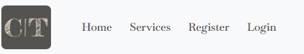 
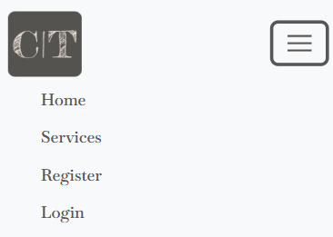 |
|2|**Login/Register** button disappears when user is logged in |Pass| Register disappears when the user is logged in and appears if the user has not been authenticated. Registered/Logged in users can **Make Booking** and view **My Bookings**. 
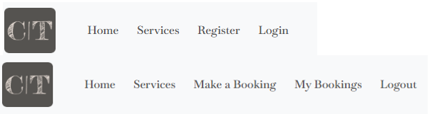|
|3| Social links go to the correct external pages |Pass| All links were tested by clicking them, **Facebook, X, Instagram**. 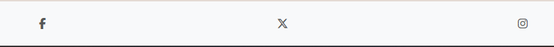|
|4| clicking on **Services** within the navigation bar goes to the services page. The <em>browse services</em> link on the home page was also tested by clicking the link. |Pass| Clicking Services tab within Navigation Bar and Link on homepage. |
|5| Clicking **Make a Booking** takes the user to the booking form. **My Bookings** takes the user to any booked - Booking Details. So the user can view any bookings they made |Pass| By clicking either Make a Booking or My Bookings within the Navigation Bar. Make a Booking can also be accessed via Link on Homepage. 
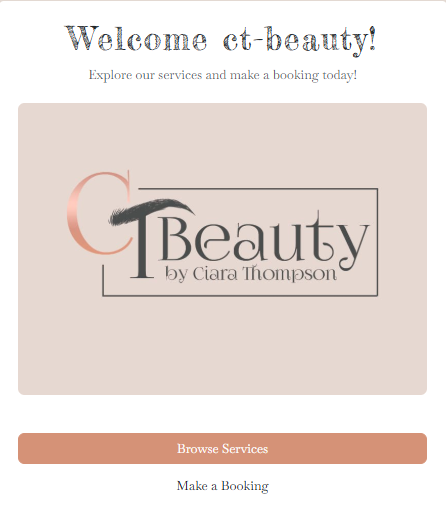 |
|6| Logout directs the user to Signout confirmation page |Pass| By clicking Logout the user is asked to confirm if they wish to Sign Out . 
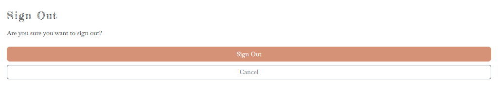 |
|7| User **Forgot Password** while logging in |Pass| By clicking Forgot Password the user recieves an email notifiying them that a password reset was requested. If the user follows the in email link they are taken to a form to reset there password. 
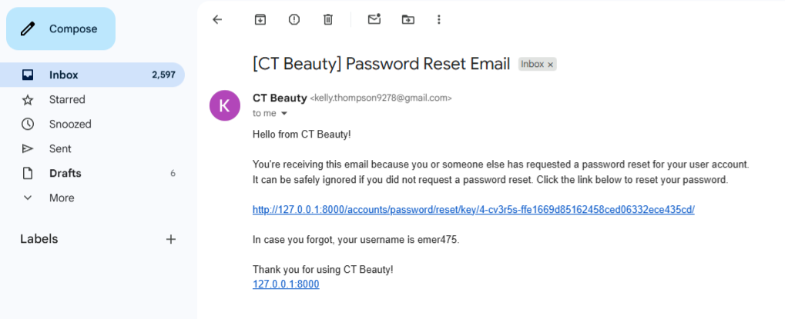
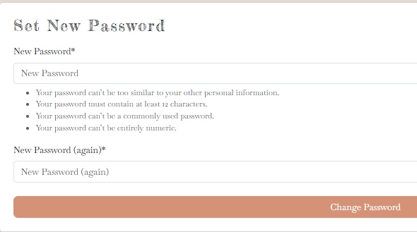
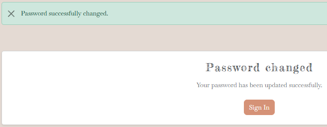 |

### **Make a Booking**
|Test #|Test|Results|Evidence|
| --- | --- | --- | --- |
|1| Booking Form **Validation** and **Error Handling** |Pass| All fields required before submit. Notes cannot accept just numbers, letters are also required, spacing allowed.  
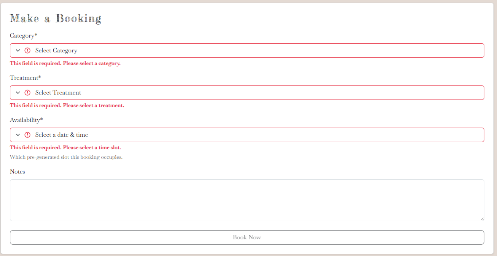
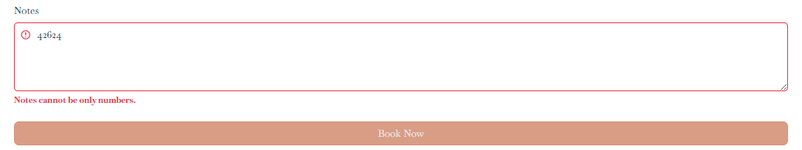|
|2| Booking Form **accepts** booking and **redirects** the user to My Bookings |Pass| When the user fills in the Booking Form and clicks Book Now, the user is redirected to My Bookings, where they can view booking details, edit and delete their booking.  
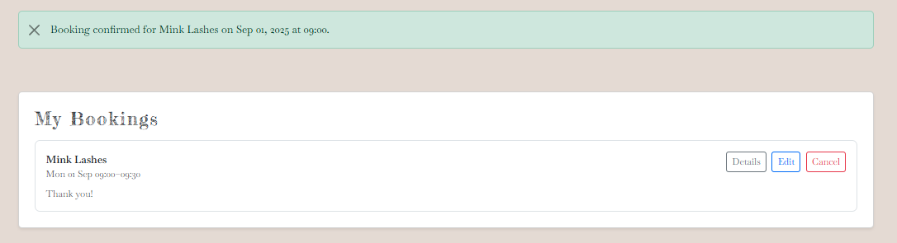
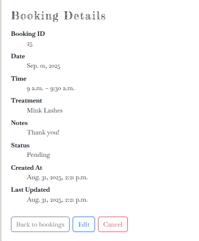|
|3| User can **Edit** their booking by clicking edit. By Clicking edit the user can only change the appointment availability.|Pass| Availability is the only area of the form that can be amended, all other fields are shaded.  
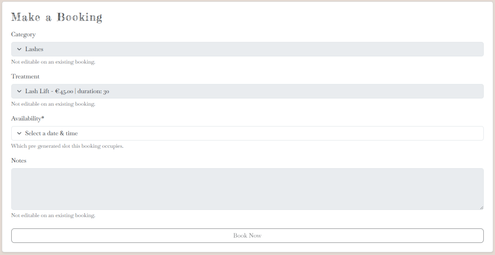|
|4| User can **Cancel** their booking at any time. |Pass| By clicking the Cancel button and confirming cancellation.  
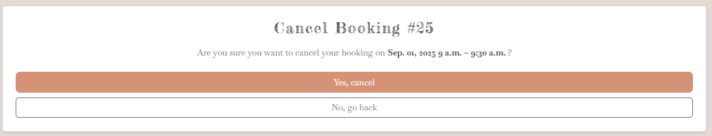 |
|5| Slots that are booked, are **removed** from availability. |Pass| As above booking confirmed on the <em>1st of September, 09.00am to 09.30am</em>. On further booking attempt, this slot no longer exists. 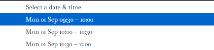 |
|6| Slots that are **Amended(Edited)** are returned to Availability. |Pass| User clicks Edit, changes Booking Availability to <em>1st of September, 09.30am to 10.00am</em>, previous slot booked returns to availability.  
 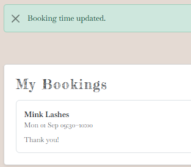 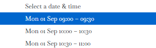 |
|7| Slots that are **Cancelled** return to Available Slots. |Pass| User clicks Cancel, confirms Cancellation, is redirected to My Bookings and recieves confirmation message.  
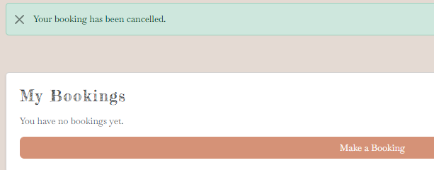 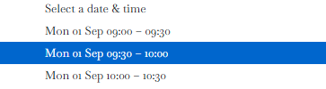|

### **Register**
|Test #|Test|Results|Evidence|
| --- | --- | --- | --- |
|1| Registration Form(Sign Up) **Validation** and **Error Handling** |Pass| All fields required before submit. Username takes only letters and numbers, Email field accepts only valid email addresses, First name and Last name allows for letters and spacing and Password has acceptance criteria which includes 12 or more characters and cannot be entirely numeric.  
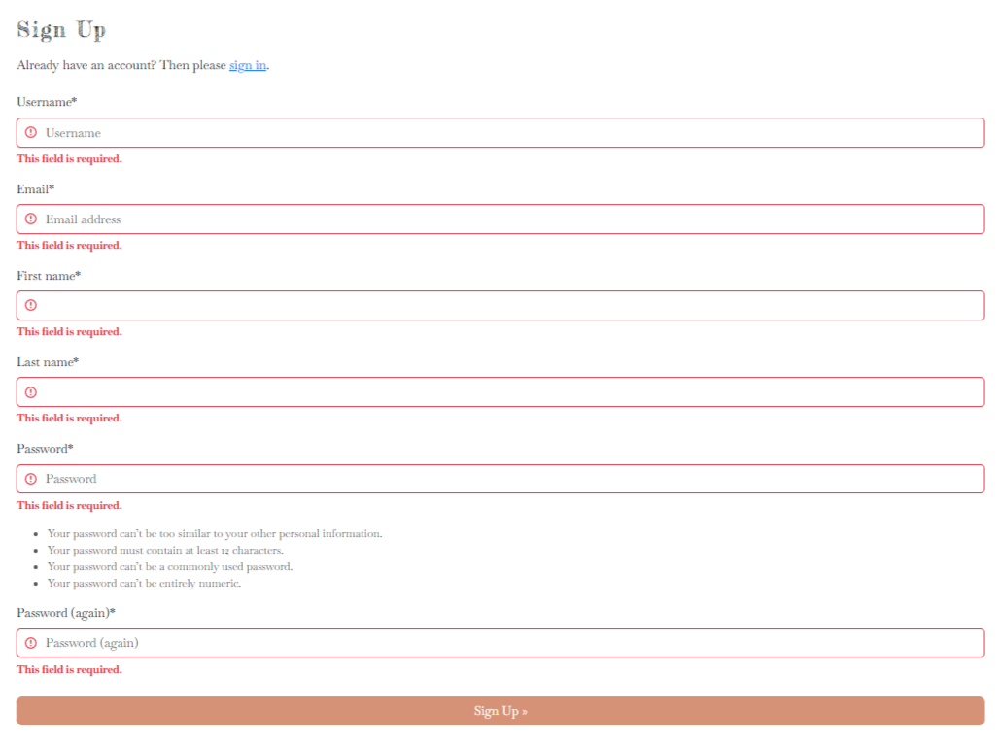
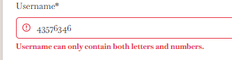
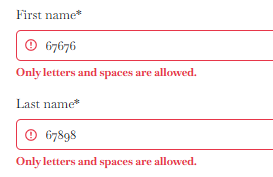|
|2| On Registering an account user is Logged in and recieves **Alert Messages** and an **Confirmation Email** |Pass| Link sent via Email, user clicks the in email link and is redirected back to the site where confirmation is requested and verified.   
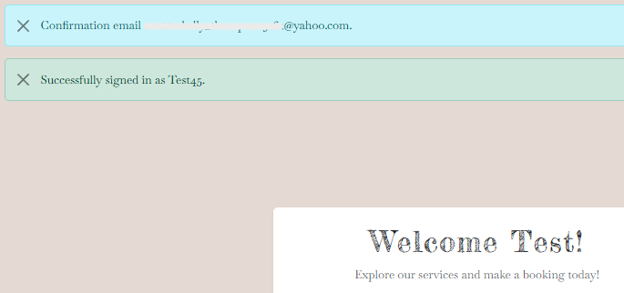
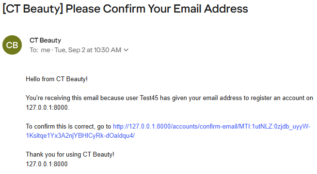
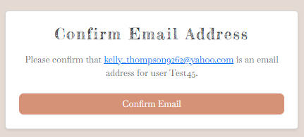
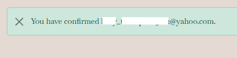|

## **Unit Tests**
A single unit test was implemented using Django’s built-in TestCase.

- **Tested view**: `make_booking`

- **Purpose**: confirm that the view responds correctly and renders the expected template when accessed.

- **Framework**: Django’s <em>TestCase</em> class

This test was included as a proof of concept to demonstrate how automated testing can be applied to the project. ➡️ View in [**tests**](bookings/tests/test_makebooking_view.py).

## **User Story Testing**
- **Milestone: Functional Booking System**.

  **1.** As a logged-in user, I want to select a treatment, date, and time, So that I can schedule an appointment. **PASS**✔️

  **2.** As a potential customer, I want to browse the available treatments, So that I can decide which service to book. **PASS**✔️

  **3.** As a user, I want to see available dates and times, So that I can choose a suitable appointment slot. **PASS**✔️

  **4.** As a logged-in user, I want to view a list of my upcoming appointments, So that I can keep track of them. **PASS**✔️

  **5.** As a customer, I want to receive a booking success message, so that I know my booking is successful. **PASS**✔️

  **6.** As a user, I want to cancel or change my booking, So that I can manage my schedule as needed. **PASS**✔️

- **Milestone: Implementing User Registration and Login**.

  **1.** As a new customer, I want to register an account, So that I can log in and make a booking for a treatment. **PASS**✔️

  **2.** As a logged-in user, I want to log out of my account so that I can ensure my data is secure. **PASS**✔️

  **3.** As a user who forgot my password, I want to reset it using my email, So that I can regain access to my account. **PASS**✔️

  **4.** As a registered user, I want to log in to my account, so that I can access my personal dashboard and make or manage bookings. **PASS**✔️

- **Milestone: Admin Privileges & Control Panel**.

  **1.** As an admin, I want to view all upcoming bookings, So that I can prepare for upcoming appointments. **PASS**✔️

  **2.** As an admin, I want to change or cancel bookings, So that I can manage conflicts or emergencies. **PASS**✔️

  **3.** As an admin, I want to set my available working hours, So that customers can only book during those times. **PASS**✔️

## **Automated Testing**
### LightHouse
Lighthouse (built into Chrome DevTools) was used to audit the site for performance, accessibility, best practices, and SEO.

The following scores were recorded:  
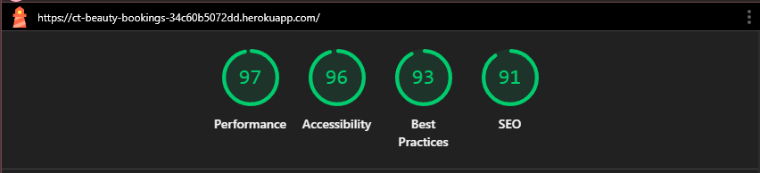

## **Devices Used**
> Browsers used to Test CT-Beauty Bookings:

### **Desktop**
- FireFox 142.0.1
- Google Chrome 139.0.7258.155
- Safari 18.6

### **Mobile**
- Chrome for Android 139.0.7258.158
- Safari iOS 17
